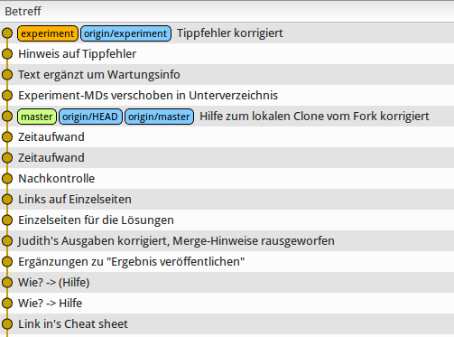

Training: Git-Rebase (grundlegend)
==================================

Dies ist das grundlegende Training zu Git-Rebase.
Es dient dazu, dass Du Erfahrungen im Umgang mit
Git-Rebase sammelst.

Voraussetzungen
---------------

Seitens der "Infrastruktur" gibt es diese Voraussetzungen:

* Git-Kommandozeilen-Tools sind installiert
* Gitg ist installiert (`sudo apt-get install gitg`)
* Fork von diesem Repo ist angelegt, Arbeit erfolgt nur an
  diesem Fork
* Du hast einen lokalen Clone vom Fork (`git clone (fork-url)` mit "(fork-url)" von oben rechts)
* Dein Arbeitsverzeichnis ist im lokalen Clone

Seitens der Kenntnisse:

* Erfahrung mit der Kommandozeile
* Erfahrung mit Git (clone, branch, pull/push, commit, ...)

Ausgangsituation
----------------

- Es gibt einen Master-Branch
- ... und auch den Branch "experiment"
- "experiment" wurde irgendwann in der Vergangenheit erzeugt,
  er zweigt in der Vergangenheit vom Master-Branch ab
- Die Ausgangssituation kannst Du visualisieren mit `gitg origin/master origin/experiment`

Zielbild
--------

- Es gibt einen Master-Branch
- ... und auch den Branch "experiment"
- Der Abzweigezeitpunkt von "expriment" ist verschoben
  auf den aktuellen Master-Branch

Ablauf
------

### Vorbereitungen

- Stelle sicher, dass alle Änderungen am zentralen Repo bei Dir lokal verfügbar sind [Wie?](cheat-sheet/cheat-sheet.md#0010)
- Visualisiere die Situation [Wie?](cheat-sheet/cheat-sheet.md#0020)
- Kontrolliere, ob "master" und "origin/master" übereinstimmen!
- Kontrolliere, ob "experiment" und "origin/experiment" übereinstimmen!

### Durchführung

- Branch "experiment" auschecken [Wie?](cheat-sheet/cheat-sheet.md#0110)
- Branch "experiment" aktualisieren [Wie?](cheat-sheet/cheat-sheet.md#0120)
- Rebase durchführen [Wie?](cheat-sheet/cheat-sheet.md#0130)
- Sichten [Wie?](cheat-sheet/cheat-sheet.md#0140)
- Ergebnis "veröffentlichen" [Wie?](cheat-sheet/cheat-sheet.md#0150)

Nachkontrolle
-------------

- Visualisiere die Situation  [Wie?](cheat-sheet/cheat-sheet.md#0210)
- Kontrolliere, ob "master" und "origin/master" übereinstimmen!
- Kontrolliere, ob "experiment" und "origin/experiment" übereinstimmen!
- Vergleiche Dein Bild strukturell mit [images/final.png](images/final.png)

Abschluß
--------

Nach Abschluß des Trainings bitte die URL zu dem bearbeiteten
Fork per Email schicken an "dp-training@daemons-point.com"!

dp-git-rebase-test
===============

Test Repository zum Ausprobieren von "git rebase"

Genau und hier wird getestet:

kannst Du bitte ein Test-Repo in gitbucket anlegen? Name: dp-git-rebase-test    

Darin:   
- Grob 5 Dateien   
- Jeweils grob eine Bildschirmseite groß  
- Insgesamt grob 10 "Commits" für den Master  

Dann:   
- Branch anlegen, Name: "experiment" oder so ähnlich   
- Grob 5 Änderungen am Branch machen, push nicht vergessen!   
- Zurück zum Master   
- Dort diverse andere Änderungen machen (an anderen Stellen wie im Branch), auch push nicht vergessen!   

Link an Uli schicken.
