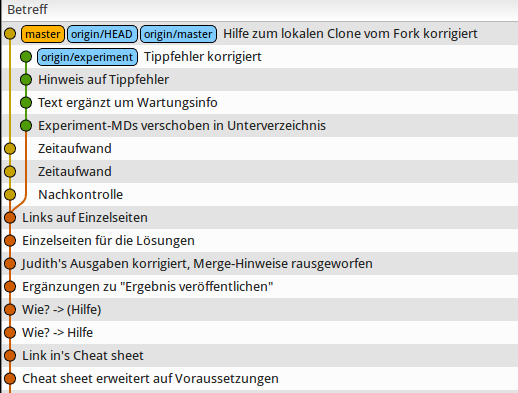

Training: Git-Rebase (fortgeschritten)
======================================

Bitte führe dieses Training erst durch, wenn die
"Git-Rebase (grundlegend)" durchgeführt hast!

Voraussetzungen
---------------

* "Git-Rebase (grundlegend)" ist durchgeführt und wird
  inhaltlich beherrscht!

* Git-Kommandozeilen-Tools sind installiert

* Meld ist installiert (`sudo apt-get install meld`)

* Gitg ist installiert (`sudo apt-get install gitg`)

* Fork von diesem Repo ist angelegt, Arbeit erfolgt nur an
  diesem Fork

Ausgangsituation
----------------

- Es gibt einen Master-Branch
- ... und auch den Branch "experiment"
- "experiment" wurde irgendwann in der Vergangenheit erzeugt,
  er zweigt in der Vergangenheit vom Master-Branch ab

Zielbild
--------

- Es gibt einen Master-Branch
- ... und auch den Branch "experiment"
- Der Abzweigezeitpunkt von "expriment" ist verschoben
  auf den aktuellen Master-Branch

Ablauf
------

Abschluß
--------

Nach Abschluß des Trainings bitte die URL zu dem bearbeiteten
Fork per Email schicken an "dp-training@daemons-point.com"!

dp-git-rebase-test
===============

Test Repository zum Ausprobieren von "git rebase"

Genau und hier wird getestet:

kannst Du bitte ein Test-Repo in gitbucket anlegen? Name: dp-git-rebase-test    

Darin:   
- Grob 5 Dateien   
- Jeweils grob eine Bildschirmseite groß  
- Insgesamt grob 10 "Commits" für den Master  

Dann:   
- Branch anlegen, Name: "experiment" oder so ähnlich   
- Grob 5 Änderungen am Branch machen, push nicht vergessen!   
- Zurück zum Master   
- Dort diverse andere Änderungen machen (an anderen Stellen wie im Branch), auch push nicht vergessen!   

Link an Uli schicken.
