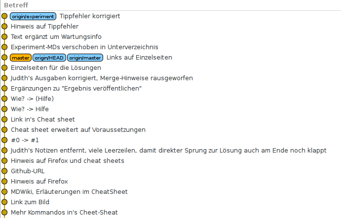

NACHKONTROLLE
=============

- URL notieren, bspw: https://github.com/jupla/git-rebase-training-basic
- Clone erzeugen:
    ```
    cd /tmp
    git clone https://github.com/jupla/git-rebase-training-basic judith-basic
    cd judith-basic
    ```
- Clone sichten: `gitg  origin/master origin/experiment`

Wenn's richtig erledigt ist, dann sieht's in etwa so aus:



